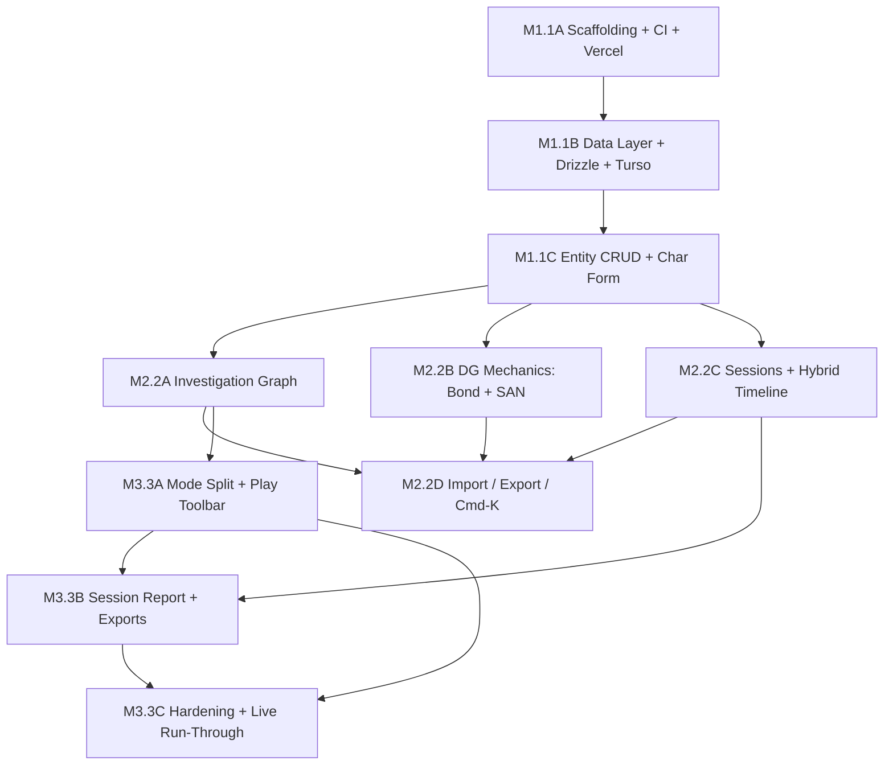

# Delta Green Campaign Manager Architecture

## 1. Introduction and Goals

The Delta Green Campaign Manager (`dg-campaign-manager`) is a single-user, GM-only web application for organizing tabletop campaigns of *Delta Green: The Role-Playing Game* (Arc Dream, 2016+). It is a personal **GM workbench** that replaces scattered Obsidian/Notion notes with a graph-shaped, DG-native data model: typed entities (Scenarios, Scenes, NPCs, PCs, Clues, Items, Factions, Locations, Sessions) connected by first-class typed relationships, plus a rules-faithful character generator for both PCs and NPCs.

Every feature exists to make the GM faster at one of two tasks: prepping the next session or answering a question at the table. The tool's primary job is **persistent memory across sessions** — clue delivery state, NPC continuity, faction movements, PC backstory hooks, Bonds, and Sanity all preserved and surfaced rather than re-derived from prose each week.

### 1.1 Requirements Overview

This table summarizes the Must- and Should-Have requirements driving the architecture. The complete REQ-ID register lives in PRD.md §8.3.

| REQ-ID | Requirement | Priority |
|--------|-------------|----------|
| REQ-001 | Typed entity model (Campaign, Scenario, Scene, NPC, PC, Clue, Item, Faction, Location, Session, Bond) | Must |
| REQ-002 | Scene as hybrid nestable entity (own URL, lives under Scenario) | Must |
| REQ-003 | Typed first-class relationships between entities | Must |
| REQ-004 | PC entity with full DG RAW fields | Must |
| REQ-005 | NPC entity with stats + RP hooks + faction + status + relationships | Must |
| REQ-006 | Bonds as first-class structured records with damage history | Must |
| REQ-007 | Sanity tracking (current/max, breaking points, disorders, change log) | Must |
| REQ-008 | Character form with skill-package presets, shared PC/NPC editor | Must |
| REQ-009 | Clue with provenance + typed edges + delivery tracking | Must |
| REQ-010 | Session with hybrid in-game / real-world timeline | Must |
| REQ-011 | Auto-derived session report from tagged entity activity + freeform notes | Must |
| REQ-012 | Player handout export from session | Should |
| REQ-013 | Cmd-K global search palette | Must |
| REQ-014 | List views per entity type with filtering | Must |
| REQ-015 | Entity detail surfaces incoming/outgoing relationships + recent session activity | Must |
| REQ-016 | Bulk import scenario from structured Markdown template | Must |
| REQ-017 | Per-entity Markdown export | Must |
| REQ-018 | Campaign-wide Markdown archive export | Should |
| REQ-019 | Distinct prep and play modes | Must |
| REQ-020 | Play-mode primary actions (Cmd-K + 4 GM ops) | Must |
| REQ-024 | Location surfaces clues + NPCs + items + prior session events | Must |
| REQ-025 | Faction with status timeline, member NPCs, implicating clues | Must |
| REQ-026 | Item with location + owner + reverse refs | Must |
| REQ-N01 | Cmd-K results <1s for 1,000-entity datasets | Must |
| REQ-N02 | Page navigation <500ms | Must |
| REQ-N03 | No interactive auth; deployment-URL + env-credential access model | Must |
| REQ-N04 | Markdown export portability for every entity | Must |
| REQ-N05 | Daily automated DB backup via Turso | Should |
| REQ-N06 | Desktop browsers (Chrome/Firefox/Safari latest two) | Must |
| REQ-N07 | Keyboard-first play mode | Should |
| REQ-N08 | TypeScript strict + ESLint + Prettier | Must |
| REQ-N09 | Vitest unit tests for critical domain logic | Must |
| REQ-N10 | Drizzle migrations check-in | Must |
| REQ-N11 | Foundational greenfield scaffold | Must |
| REQ-N12 | Vercel hosting | Must |
| INT-001 | Turso (libSQL) integration | Must |
| INT-002 | Vercel integration | Must |

### 1.2 Quality Goals

| Priority | Quality Goal | Motivation |
|----------|-------------|------------|
| 1 | At-table retrieval speed | The GM must answer "what do players know about X?" in seconds (REQ-N01, OM-3); slow retrieval kills the workbench premise |
| 2 | Persistent campaign memory & data portability | Every entity exportable to Markdown (REQ-N04); the user must trust that state survives platform outages |
| 3 | Maintainability for a solo agentic developer | Strict TS + Drizzle migrations + pure-TS domain modules + Vitest (REQ-N08, N09, N10) — the codebase has to stay hackable across weekend cadence |

### 1.3 Stakeholders

| Role | Name / Team | Expectations |
|------|------------|--------------|
| Sole author, sole developer, sole user | Bartosz | Tool is enjoyable to build; codebase stays hackable; v1 is usable at the table for a real published Arc Dream campaign within ~6 weekends |

---

## 2. Architecture Constraints

| Type | Constraint | Rationale |
|------|-----------|-----------|
| Technical | Vite + React 18 + TypeScript (strict) frontend | PRD §3.3 — fixed stack consistent with the user's other personal projects |
| Technical | Turso (libSQL) + Drizzle ORM as the data layer | PRD §3.3 — graph-friendly relational queries, FK integrity, free tier |
| Technical | Vercel hosting (free tier) with Serverless Functions for API | PRD §3.3, REQ-N12 — no separate backend service; budget = free tier |
| Technical | No interactive auth; access gated by deployment URL secrecy + env-bound DB credentials | REQ-N03; auth costs more than it earns at single-user scale |
| Technical | Desktop browsers only (Chrome/Firefox/Safari latest two) | REQ-N06; mobile explicitly out of scope (REQ-W04) |
| Technical | AI-fluent solo developer; agentic development is the methodology, not a supplement | Calendar assumes Heavy AI leverage on scaffolding/CRUD |
| Organizational | Personal project; no team, no client, no QA, no compliance scope | PRD §3 — sole user is also sole developer |
| Organizational | Weekend cadence; ~6 weekends to v1 | PRD §3.3 timeline |
| Organizational | v1 acceptance gated on running a real live Delta Green session through the tool | PRD §6.2 — the only external validation channel |

---

## 3. System Scope and Context

### 3.1 Business Context

The system has a single human actor (the GM) and no third-party business systems. The GM both authors and consumes all data.

| Actor | Input | Output | Description |
|-------|-------|--------|-------------|
| **GM (Bartosz)** | Campaign data entry: PCs, NPCs, scenarios, clues, sessions, SAN/Bond changes; published-scenario Markdown imports | Cmd-K retrieval; entity detail surfaces; auto-derived session reports; per-entity and whole-campaign Markdown exports; player handouts | Single user; sole authority over all data; uses the app for prep between sessions and lookup at the table |
| **Players (indirect)** | None — no direct system access | Receive printed/exported player handouts | Players never log in, never see the app; they consume content via REQ-012 handout export only |

### 3.2 Technical Context

| Channel / Interface | Protocol | Direction | Description |
|--------------------|----------|-----------|-------------|
| Browser ↔ Vercel (SPA) | HTTPS (TLS 1.3) | Bidirectional | Serves the static React SPA bundle |
| Browser ↔ Vercel Serverless Functions (`/api/*`) | HTTPS / JSON | Bidirectional | All CRUD, search index, MD import/export, event tagging |
| Vercel Functions ↔ Turso libSQL | HTTPS + libSQL auth token | Outbound from API | All DB reads/writes; credentials never leave the server |
| GitHub ↔ Vercel | Git integration webhook | One-way (push triggers deploy) | Build/deploy pipeline; preview deploys per branch, prod on `main` |
| GitHub Actions CI | GitHub Actions runner | One-way | Lint + typecheck + Vitest on PR and `main` |

---

## 4. Solution Strategy

| Goal | Approach | Technology / Pattern |
|------|---------|---------------------|
| Persistent, queryable campaign memory | Typed entities + first-class typed edges in a relational DB | Turso (libSQL), Drizzle ORM |
| Sub-second at-table retrieval (REQ-N01) | Client-side denormalized search index loaded once, in-memory fuzzy match | In-memory JS index, fuzzy match library |
| DG-rules-faithful PC/NPC modeling | Pure-TS domain modules with explicit types and unit tests | TypeScript strict, Vitest, `domain/` layer with no React or Drizzle imports |
| Bulk import of published scenarios (REQ-016) | YAML+MD parser running server-side with transactional writes | Vercel Functions + libSQL transactions |
| Markdown portability (REQ-N04, REQ-017, REQ-018) | Deterministic per-entity MD serializer; whole-campaign archive | Server-side serializer, ZIP generation |
| Workbench-grade UX (prep + play modes) | Single SPA with global mode state and keyboard-first play toolbar | React + Tailwind, react-hotkeys-hook |
| Single-user free-tier hosting | Static SPA + co-located serverless functions | Vercel free tier, Turso free tier |

---

## 5. Building Block View

### 5.1 Level 1 — System Overview

The system decomposes into three top-level milestone-aligned units of work, each comprising deliverable groups. Build order is strictly sequential (single developer).

---

#### Unit: M1 — Foundation

**Purpose:** Establish the project skeleton, deployment pipeline, schema infrastructure, and the baseline typed-entity CRUD layer that all later units depend on.

**Responsibilities:**
- Repository scaffolding (Vite + React + TS), tooling (ESLint, Prettier, Vitest, Husky), CI (GitHub Actions), Vercel deploy
- Turso provisioning, Drizzle ORM setup, initial schema + migrations
- Generic schema-driven CRUD layer (form + list + detail) for baseline entities
- DG RAW PC and NPC entity schemas with skill-package presets
- Faction, Location (baseline), Item entity editors
- Single-user access model (no auth; env-bound credentials)

**Deliverables:**
- 1A — Repo scaffolding, dev tooling, CI pipeline, Vercel deploy pipeline
- 1B — Turso provisioning, Drizzle setup, initial schema migration, seed/fixture script
- 1C — Entity routing & layout, generic CRUD components, PC schema, NPC schema, skill-package presets, Faction/Location/Item editors

**Dependencies:** None (foundational unit).

---

#### Unit: M2 — Core Workbench

**Purpose:** Make the tool useful for prep work — investigation graph, DG mechanics (Bonds + Sanity), sessions, bulk import, exports, and Cmd-K retrieval.

**Responsibilities:**
- Polymorphic typed-edge table for relationships (REQ-003)
- Clue entity with provenance + typed edges (delivery half deferred to M3)
- First-class Bond entity with damage log
- SAN block on PCs with breaking-point detection
- Session entity with hybrid IRL/in-game timeline
- Bulk MD scenario import (transactional, server-side)
- Per-entity MD export
- Cmd-K palette with client-side denormalized index
- List views with filtering per entity type
- Entity detail surfacing of incoming/outgoing relationships
- Domain unit tests (char-gen math, SAN/Bond mutation, clue-delivery transitions, MD import parsing)

**Deliverables:**
- 2A — Relationships table & API, Clue entity, reverse-ref surfacing, edge domain tests
- 2B — Bond entity & UI, SAN block & UI, mechanic unit tests
- 2C — Session entity, in-game + real-session timeline views
- 2D — MD scenario template spec, bulk MD importer, per-entity MD export, Cmd-K palette, list views with filters

**Dependencies:** M1 (entity schemas, Drizzle plumbing, character form).

---

#### Unit: M3 — Campaign-Run-Ready

**Purpose:** Make the tool usable at the table during a real campaign session — mode split, play-mode primary actions, auto-derived session reports, exports for handouts and archive, and the live-session run-through that gates v1.

**Responsibilities:**
- Distinct prep and play modes with toggle persisted in URL + localStorage
- Play-mode primary actions toolbar (Cmd-K, mark clue delivered, log SAN change, log Bond damage, jump to Session)
- Clue delivery tracking flow (session + recipient PCs)
- Implicit event tagging during play mode (mutations stamp the active Session)
- Auto-derived session report (structured event log + freeform notes)
- Player handout export from a Session (player-safe content only)
- Whole-campaign Markdown archive export
- Keyboard shortcuts overlay for play-mode actions
- Cross-browser pass; Turso PITR backup verification
- Live-session run-through against an imported published scenario

**Deliverables:**
- 3A — Mode toggle + theming, play-mode primary actions toolbar, clue delivery flow, keyboard shortcuts
- 3B — Event tagging hooks, auto-derived session report UI, player handout exporter, campaign archive exporter
- 3C — Cross-browser pass, backup verification, live-session run-through, post-run-through bug fixes

**Dependencies:** M1 (entities) + M2 (sessions, edges, exports, mechanics).

---

### 5.2 Level 2 — Unit Internals

#### Unit: M1 — Foundation

##### Subcomponent: Web App Shell

**Purpose:** Vite + React SPA serving the GM's UI; entry point for all routing and layout.
**Interfaces:** Calls TanStack Query hooks → `/api/*`; renders form/list/detail components driven by entity schema.
**Key decisions:** Schema-driven UI: entity schema is the single source of truth for TS types, DB schema, and form fields.

##### Subcomponent: Drizzle ORM Layer

**Purpose:** Single source of truth for schema; provides typed query/mutation API and migration tooling.
**Interfaces:** Vercel Functions import schema and queries; `drizzle-kit` produces migration files committed to repo.
**Key decisions:** All schema changes go through Drizzle migrations (REQ-N10); no ad-hoc SQL in code.

##### Subcomponent: Form/List/Detail UI Kit

**Purpose:** Generic, schema-driven CRUD components that serve all baseline entities.
**Interfaces:** Receives entity schema + Zod validator; emits validated payloads to mutation hooks.
**Key decisions:** One generic component set serves all 7 baseline entities; entity-specific UI is opt-in customization.

##### Subcomponent: Char Form Module

**Purpose:** DG RAW field tree + skill-package presets, shared between PC and NPC editors.
**Interfaces:** `Domain.skillPackages.lookup(profession)` returns skill values for pre-fill; values remain editable.
**Key decisions:** Same form for PC and NPC; NPCs may leave fields empty. Manual override always available.

#### Unit: M2 — Core Workbench

##### Subcomponent: Investigation Graph Module

**Purpose:** Owns typed edges between entities; powers reverse-ref surfaces.
**Interfaces:** `POST /api/relationships`, `GET /api/entities/{type}/{id}?include=incoming,outgoing`.
**Key decisions:** Polymorphic edge table over per-pair junction tables (ADR-002); kind allowlist enforced at app layer.

##### Subcomponent: DG Mechanics Module

**Purpose:** Bond and SAN services with mutation event log.
**Interfaces:** `Domain.sanity.applyLoss()`, `Domain.bonds.applyDamage()`; persist via dedicated event endpoints.
**Key decisions:** Breaking-point detection lives in pure-TS domain so it can be unit-tested in isolation (ADR-005).

##### Subcomponent: Session Module

**Purpose:** Hybrid timeline (IRL + in-game) and event tagging substrate.
**Interfaces:** `/api/sessions/{id}/events`; in-game-ordered and real-session-ordered list views.
**Key decisions:** Sessions hold the substrate for REQ-011 auto-derived report; event-tag rows are appended by mechanic and clue mutations.

##### Subcomponent: Import / Export Module

**Purpose:** MD scenario parser (server-side, transactional) and per-entity MD serializer.
**Interfaces:** `POST /api/import/scenario`, `GET /api/export/entity/{type}/{id}`.
**Key decisions:** Parser is pure TS and unit-tested; DB write is a thin transactional wrapper. Import is atomic — partial imports rejected.

##### Subcomponent: Retrieval Module

**Purpose:** Cmd-K palette + filtered list views.
**Interfaces:** `GET /api/search/index` (cold start), in-memory fuzzy match thereafter; `GET /api/entities/{type}?filter=…` for lists.
**Key decisions:** Client-side denormalized index for sub-1s response (ADR-003); refresh on every successful mutation.

#### Unit: M3 — Campaign-Run-Ready

##### Subcomponent: App Shell & Mode Layer

**Purpose:** Mode toggle (prep/play), play-mode toolbar, keyboard shortcut layer.
**Interfaces:** Global state slice persisted in localStorage and reflected in URL (`?mode=play`).
**Key decisions:** Mode is purely client-side; the API is mode-agnostic.

##### Subcomponent: Event Tagging

**Purpose:** Implicit stamping of session-scoped mutations (clue deliveries, NPC encounters, SAN/Bond changes) onto the active Session id during play mode.
**Interfaces:** Active-session id from app-shell state; appended to events on every relevant API call.
**Key decisions:** Implicit, not explicit — any in-play mutation that touches a session-scoped entity stamps the active session id automatically.

##### Subcomponent: Session Report

**Purpose:** Renders auto-derived structured event log + freeform notes editor on Session detail page.
**Interfaces:** `GET /api/sessions/{id}?include=events`.
**Key decisions:** Both sections (structured + freeform) saved separately; freeform never overwrites structured.

##### Subcomponent: Export Module (M3 additions)

**Purpose:** Player handout export from Session; whole-campaign MD archive.
**Interfaces:** `GET /api/export/session/{id}/handout`, `GET /api/export/campaign`.
**Key decisions:** Handout filters out GM-only content; archive is a ZIP stream of one MD file per entity.

---

### 5.3 Build Order

| Order | Unit | Rationale |
|-------|------|-----------|
| 1 | M1 — Foundation | Foundational; all later work depends on schema, deploy, and CRUD layer |
| 2 | M2 — Core Workbench | Builds on M1 entities; delivers the highest-design-risk features (graph, MD import) so M3 can polish on real data |
| 3 | M3 — Campaign-Run-Ready | At-the-table features only meaningful once real campaign data exists; gates v1 with the live-session run-through |

Within M2, deliverable groups have intra-unit ordering: 2A (graph) and 2B (mechanics) and 2C (sessions) are independent and can interleave; 2D (import/export/Cmd-K) depends on 2A.

### 5.4 Dependency Matrix



Single workstream — one developer, no parallel-stream coordination.

---

## 6. Runtime View

Building blocks referenced: `SPA` (React app), `API` (Vercel Function), `DB` (Turso libSQL), `Domain` (pure-TS module).

### Scenario: Create a PC or NPC (REQ-001 / REQ-002 / REQ-004 / REQ-005 / REQ-008)

1. SPA: GM opens character form; profession select fires `Domain.skillPackages.lookup(profession)` to pre-fill skills.
2. SPA: form submission validated by Zod schema (derived from Drizzle schema).
3. SPA → API (`POST /api/entities/pc`): payload over HTTPS.
4. API → DB: `INSERT` via Drizzle in a single transaction (PC + initial Bond/SAN structures).
5. API → SPA: returns persisted entity with id; TanStack Query invalidates the PC list.

**Decision points:** schema validation rejects malformed RAW fields before DB write; domain module is the single source of truth for skill-package math.

### Scenario: Create a typed relationship and surface reverse refs (REQ-003 / REQ-015)

1. SPA: GM opens Clue detail, "Link to Faction" action.
2. SPA → API (`POST /api/relationships`): `{kind: 'clue→faction', source_id, target_id}`.
3. API → DB: validates `kind` against allowlist; inserts into polymorphic `relationships` table; returns success.
4. SPA: invalidates Faction detail query; on reload, Faction page issues `GET /api/entities/faction/{id}?include=incoming` and the Clue appears under "Implicating clues".

**Decision point:** `kind` allowlist is the integrity boundary in lieu of per-pair FKs.

### Scenario: Apply Bond damage / SAN loss (REQ-006 / REQ-007)

1. SPA (play mode): GM clicks "Log SAN change" toolbar action; modal collects amount + source.
2. SPA: `Domain.sanity.applyLoss(pc, amount)` computes new current SAN and detects breaking-point crossing locally for instant feedback.
3. SPA → API (`POST /api/entities/pc/{id}/san-event`): persists the event and updated current SAN.
4. API → DB: appends to SAN change log; updates `pc.current_san`; if active session present, also stamps event onto Session via REQ-011 hook.

**Decision point:** breaking-point detection lives in `Domain.sanity` so it can be unit-tested in isolation.

### Scenario: Mark a clue delivered (REQ-009)

1. SPA (play mode): GM hits "Mark clue delivered"; modal asks for active Session and recipient PCs (defaults: current Session, all PCs).
2. SPA → API (`POST /api/clues/{id}/deliveries`): `{session_id, pc_ids[]}`.
3. API → DB: insert delivery record; insert event-tag rows for the Session.
4. API → SPA: success; SPA invalidates Clue and Session queries.

**Decision point:** delivery is append-only; un-delivering creates a corrective event rather than mutating history.

### Scenario: Session detail with auto-derived report (REQ-010 / REQ-011)

1. SPA: opens Session detail page → `GET /api/sessions/{id}?include=events`.
2. API → DB: joins event-tag rows (clue deliveries, NPC encounters, SAN/Bond mutations stamped during the session) into a structured event log.
3. SPA: renders structured log + freeform notes editor; both saved separately.

**Decision point:** event-tagging is implicit during play mode — any in-play mutation that touches a session-scoped entity stamps the active session id automatically.

### Scenario: Cmd-K palette (REQ-013 / REQ-N01)

1. SPA cold start: `GET /api/search/index` returns a compact array `[{id, type, name, aliases}, …]`.
2. SPA: holds index in memory; on Cmd-K input, runs fuzzy match locally; renders matches synchronously.
3. SPA: on entity create/update, refreshes only the affected index slice (or full reload at <1s cost).

**Decision point:** server is the index source of truth; client is the search engine. No round-trip per keystroke.

### Scenario: Bulk MD scenario import (REQ-016)

1. SPA: GM uploads `.md` file to `/api/import/scenario`.
2. API: streams file, runs `Domain.mdImport.parse()` (validates schema, returns AST or detailed errors with line/field).
3. API: opens libSQL transaction; inserts Scenario, Scenes, NPCs, Clues, Items, Locations; inserts relationships; commits or rolls back atomically.
4. API → SPA: returns import summary or structured errors.

**Decision point:** parser and DB write are decoupled — parser is pure TS and unit-tested; DB write is a thin transactional wrapper.

### Scenario: Per-entity MD export (REQ-017)

1. SPA: GM clicks "Download as Markdown" on entity detail.
2. SPA → API (`GET /api/export/entity/{type}/{id}`): returns deterministic MD via `Domain.mdExport.serialize(entity, outgoingEdges)`.
3. SPA: triggers browser download.

### Scenario: Prep/play mode + primary actions (REQ-019 / REQ-020)

1. SPA: mode is a global state slice persisted in localStorage and reflected in URL query (`?mode=play`).
2. App shell renders a play-mode toolbar in play mode with five actions (Cmd-K, mark clue delivered, log SAN, log Bond damage, jump to Session); each is a 1-key shortcut documented under `?` overlay.

**Decision point:** mode is purely client-side; the API is mode-agnostic.

### Scenario: Location surfacing (REQ-024)

1. SPA: opens Location detail → `GET /api/entities/location/{id}?include=incoming,outgoing,sessions`.
2. API → DB: joins relationships + session-tag rows where `target = this location`.
3. SPA: renders panels for clues, NPCs at this location, items here, prior session events here.

### Scenario: Faction detail (REQ-025)

1. SPA: opens Faction detail → `GET /api/entities/faction/{id}?include=members,implicating_clues,status_log`.
2. API → DB: joins NPCs where `faction_id = this`, clues via `relationships`, ordered status entries.
3. SPA: renders three panels.

---

## 7. Deployment View

| Environment | Host / Platform | Notes |
|------------|----------------|-------|
| **Local development** | Local Node.js + Vite dev server | `.env.local` with Turso credentials; runs against personal Turso DB |
| **Preview (staging-equivalent)** | Vercel preview deploys per branch | One URL per branch; same Turso DB or a "preview" branch DB if conflicts emerge |
| **Production** | Vercel `main` branch deploy + production Turso DB | Live application; PITR backups via Turso platform; only environment containing real campaign data |

No dedicated staging environment — preview deploys cover that need at this scale (ADR-006). CI runs in GitHub Actions; deploys triggered by Vercel's git integration.

---

## 8. Cross-cutting Concepts

### 8.1 Tech Stack

| Layer | Technology | Version / Notes |
|-------|-----------|----------------|
| Build / Dev | Vite | Latest stable |
| Frontend | React 18 + TypeScript (strict) | REQ-N08 — `tsconfig.strict: true` |
| Styling | Tailwind CSS | Latest stable |
| Forms | react-hook-form + Zod | Zod schemas derive from Drizzle/TS types |
| Server state | TanStack Query | Cache + invalidation matched to entity-graph access |
| ORM / Migrations | Drizzle | REQ-N10; `drizzle-kit` for migrations |
| Database | Turso (libSQL — SQLite) | Free tier; supports FKs, FTS5 if ever needed |
| Hosting | Vercel | Free tier; REQ-N12 |
| Backend runtime | Vercel Serverless Functions (Node.js) | Co-located with frontend; only place credentials live |
| Testing | Vitest + React Testing Library | REQ-N09 |
| Linting / format | ESLint + Prettier | REQ-N08 |
| Git hooks | Husky + lint-staged | REQ-N11 |
| CI | GitHub Actions | Free for personal; lint + typecheck + test gates |

### 8.2 Architectural Patterns

- **Schema-driven UI** — entity schema is the single source of truth for DB tables, TS types, Zod validators, and form fields.
- **Polymorphic typed-edge table** — one `relationships(kind, source_type, source_id, target_type, target_id)` table; kind allowlist enforced at the application layer (ADR-002).
- **Pure-TS domain layer** — `domain/` modules import neither React nor Drizzle; ORM and UI call into domain functions, never the reverse (ADR-005).
- **Client-side denormalized search index** — Cmd-K uses an in-memory index loaded once, refreshed on mutation (ADR-003).
- **Implicit event tagging** — play-mode mutations stamp the active Session automatically; auto-derived report is a join over those events.
- **Transactional MD import** — server-side parser + libSQL transaction; partial imports rejected.

### 8.3 Conventions

- Folder boundaries enforce dependency direction: `domain/` (pure) → `db/` (Drizzle) → `api/` (Vercel Functions) → `app/` (React SPA).
- All schema changes through Drizzle migrations checked into the repo (REQ-N10); no ad-hoc SQL.
- TypeScript strict, ESLint, Prettier — pre-commit hook blocks lint/type errors (REQ-N08, REQ-N11).
- Vitest covers char-gen math, SAN/Bond mutation, clue-delivery state transitions, MD import parsing (REQ-N09).
- REQ-IDs in the form `REQ-NNN` (functional), `REQ-NNN` with `N` prefix (non-functional), `REQ-WNN` (won't), `INT-NNN` (integration).

### 8.4 Security

- **Network / transport:** Vercel-managed TLS; HTTPS-only.
- **Application access (REQ-N03):** No interactive auth. Access gated by deployment URL privacy + Vercel env-bound DB credentials. Optional reinforcement (single shared bearer token) deferred until obvious need.
- **Credentials:** Turso URL + auth token live only in Vercel env vars; never in client bundle.
- **Data at rest:** Turso platform-managed encryption.
- **Data in transit:** TLS 1.3 enforced by Vercel and Turso.
- **Source control hygiene:** `.env*` files git-ignored; secrets via Vercel + GitHub Actions secrets only.
- **Compliance:** N/A — single user is also the data subject; no third parties; no analytics. Imported published-scenario content is stored privately in user's own DB; no redistribution.

### 8.5 Error Handling

- **Client errors:** TanStack Query exposes per-mutation error state; SPA renders inline error banners and Zod validation errors directly under offending fields.
- **Server errors:** Vercel Functions return structured JSON errors `{error: {code, message, details?}}` with 4xx/5xx codes; no PII in error bodies.
- **MD import errors (REQ-016):** Parser returns line/field-scoped errors before any DB write; transaction rolls back on any insert failure.
- **Logging:** Vercel function logs only — no APM, Sentry, or OpenTelemetry in v1 (deferred per ADR scope and PRD §5.3).
- **No retry/backoff layer in v1:** the only outbound call is libSQL within the same data-center; failures surface to the user directly so they know to retry.

---

## 9. Architecture Decisions

### ADR-001: Single Vercel-deployed project (no service split)

**Status:** Accepted

**Context:**
Personal single-user GM tool with free-tier hosting and one developer. The PRD fixes the stack (Vite + React + TS + Turso + Vercel) but leaves the project topology open.

**Decision Drivers:**
- Free-tier-only budget
- Solo developer with no separate ops/backend role
- Shared TS types between client and server simplify development
- Calendar pressure (~6 weekends to v1)

**Considered Options:**

#### Option A: Single project — SPA + co-located Vercel Serverless Functions
- Good, because one repo, one deploy, shared TS types.
- Good, because no service boundary to maintain.
- Bad, because functions are bound to Vercel runtime semantics (cold starts).

#### Option B: Separate frontend (Vercel) + long-lived backend service (Fly/Render/Railway)
- Good, because escapes serverless cold-start ceiling.
- Bad, because doubles ops surface; second free tier may not be sufficient long-term.
- Bad, because adds CI/CD complexity for no current benefit.

**Decision Outcome:**
Option A — single project on Vercel.

**Consequences:**
- Positive: simpler ops, simpler deployment, shared types.
- Negative: serverless functions are bound to Vercel; migration to a long-lived backend is non-trivial but unlikely needed at this scale.

**Links:** PRD §3.3, REQ-N12, INT-002.

---

### ADR-002: Polymorphic typed-edge table for relationships

**Status:** Accepted

**Context:**
REQ-003 requires many typed relationship kinds (Clue↔Clue, Clue→NPC, Clue→Faction, Clue→Location, Clue→Item, Clue→Scene, NPC↔NPC, NPC→Faction, NPC→Location, Item→Location, Scene→Location) and the set will grow. Per-pair junction tables would mean a migration per new kind.

**Decision Drivers:**
- Iteration speed during M2
- Uniform reverse-ref query (every entity's detail page joins the same table)
- Single developer cannot afford a migration per kind

**Considered Options:**

#### Option A: Single polymorphic `relationships` table with `kind` allowlist
- Good, because one table, one index, one query path for reverse refs.
- Good, because adding a kind is a TS allowlist change, not a migration.
- Bad, because no per-pair FK integrity at the DB layer.

#### Option B: Per-pair junction tables (e.g., `clue_factions`, `npc_locations`)
- Good, because real FK integrity per pair.
- Bad, because every new kind is a migration.
- Bad, because reverse-ref queries differ per table — no uniform pattern.

**Decision Outcome:**
Option A — polymorphic edge table.

**Consequences:**
- Positive: faster iteration; uniform query.
- Negative: app-level validation, kind allowlist, integration tests must compensate for absent DB-level FK integrity.

**Risk mitigation:** Spike the schema in M1.1B; if Drizzle reverse-ref ergonomics fail, fall back to Option B before M2 starts (per milestones risk register R-3).

**Links:** REQ-003, REQ-015, M2.2A.

---

### ADR-003: Client-side denormalized search index for Cmd-K

**Status:** Accepted

**Context:**
REQ-N01 demands <1s Cmd-K results on 1,000 entities. A round-trip per keystroke from edge functions cannot meet this consistently — even at edge-region latency, fuzzy matching with debouncing exceeds 1s on first interaction.

**Decision Drivers:**
- REQ-N01 hard latency target
- Single-user scale: a 1,000-entity index is small enough to ship to the browser (a few hundred KB at most)
- Mutations are infrequent — staleness window is short

**Considered Options:**

#### Option A: Client-side denormalized index
- Good, because sub-100ms response in practice.
- Good, because no per-keystroke round-trip.
- Bad, because cold-start cost is one network round-trip; index goes stale between mutations.

#### Option B: Server-side full-text search (FTS5 / libSQL FTS)
- Good, because no client memory cost.
- Bad, because every keystroke is a network round-trip; struggles with REQ-N01 at edge latency.

**Decision Outcome:**
Option A — server exposes `/api/search/index` returning compact `{id, type, name, aliases}`; SPA loads it once per session and runs in-memory fuzzy match. Refresh on every successful mutation.

**Consequences:**
- Positive: meets REQ-N01 with margin.
- Negative: index staleness between mutations; mitigated by mutation-triggered refresh.

**Links:** REQ-013, REQ-N01.

---

### ADR-004: No interactive authentication in v1

**Status:** Accepted

**Context:**
REQ-N03 — single-user app; the cost of auth (UI, session management, password recovery, etc.) outweighs the benefit at this scale. There are no other users, no multi-tenant data, and no sharing.

**Decision Drivers:**
- Single user
- No multi-tenant data
- Free-tier infra, weekend cadence — every avoided concern compounds
- Deployment URL is private, not publicly linked

**Considered Options:**

#### Option A: No interactive auth; URL secrecy + env-bound DB credentials
- Good, because zero auth code to maintain.
- Bad, because anyone with the URL can access the app.

#### Option B: Single-user passwordless auth (magic link or single password)
- Good, because URL exposure is no longer fatal.
- Bad, because adds session management, email integration, recovery flow — material work for one user.

#### Option C: Static shared bearer token in env, checked by every API endpoint
- Good, because cheap to add later.
- Bad, because client-side bundle exposure trade-offs (must be loaded from server config).

**Decision Outcome:**
Option A. Option C remains a low-cost reinforcement if URL leakage becomes a real concern.

**Consequences:**
- Positive: zero auth code.
- Negative: any URL leak compromises access; mitigated by URL secrecy and absence of public links.

**Links:** REQ-N03.

---

### ADR-005: Domain logic in pure-TS modules independent of React and Drizzle

**Status:** Accepted

**Context:**
REQ-N09 mandates unit tests for char-gen field math, SAN/Bond mutation, clue-delivery state transitions, and MD parsing. Coupling these to React or Drizzle makes tests heavier and slower — and risks accidental DB or rendering side-effects in test runs.

**Decision Drivers:**
- REQ-N09 unit testing baseline
- Solo developer wants fast tests
- DG-rules-faithful logic must be the same whether invoked from UI, API, or tests

**Considered Options:**

#### Option A: `domain/` directory with pure-TS modules; no React or Drizzle imports
- Good, because tests are pure functions over plain data.
- Good, because logic is reusable across SPA and Vercel Functions.
- Bad, because occasional duplication between Zod schemas and Drizzle schemas.

#### Option B: Domain logic embedded in React hooks / Drizzle queries
- Good, because no separate layer.
- Bad, because tests require React/DB harness; logic is hard to reuse server-side.

**Decision Outcome:**
Option A. Codegen helpers manage Zod/Drizzle schema duplication where it arises.

**Consequences:**
- Positive: high coverage at low cost; logic shared between client and server.
- Negative: occasional schema duplication.

**Links:** REQ-N09.

---

### ADR-006: Vercel preview deploys serve as the staging environment

**Status:** Accepted

**Context:**
Single developer, free tier, no team. A dedicated staging environment is overhead without obvious benefit at this scale.

**Decision Drivers:**
- Solo developer
- Free-tier budget
- Vercel's per-branch preview deploys are already first-class

**Considered Options:**

#### Option A: Use per-branch Vercel preview deploys as staging
- Good, because zero extra environment to maintain.
- Bad, because previews share the production Turso DB unless explicitly redirected.

#### Option B: Provision a dedicated staging Turso DB + staging Vercel project
- Good, because true isolation.
- Bad, because doubles env management; second free tier may not be sufficient long-term; manual data sync overhead.

**Decision Outcome:**
Option A. If the user wants destructive testing, they create a "preview" Turso branch DB at that moment.

**Consequences:**
- Positive: no extra environment overhead.
- Negative: previews share the production DB by default — caution required when running migrations from a branch.

**Links:** Environment strategy (§7).

---

## 10. Quality Requirements

### Quality Tree

- **Performance**
  - Cmd-K results < 1s on 1,000 entities (REQ-N01)
  - Page navigation < 500ms on Vercel edge (REQ-N02)
- **Reliability & Data Portability**
  - Every entity exportable as Markdown at any time (REQ-N04, REQ-017)
  - Whole-campaign archive exportable on demand (REQ-018)
  - Daily Turso PITR backup, verified once at setup (REQ-N05)
- **Maintainability**
  - TypeScript `strict: true` with zero ESLint errors on commit (REQ-N08)
  - Domain unit tests on char-gen math, SAN/Bond mutation, clue-delivery transitions, MD import parsing (REQ-N09)
  - Schema changes through Drizzle migrations (REQ-N10)
  - Foundational greenfield scaffold reproducible from repo (REQ-N11)
- **Usability**
  - Latest two stable versions of Chrome/Firefox/Safari on desktop (REQ-N06)
  - Keyboard-first play-mode navigation (REQ-N07)
- **Security**
  - No interactive auth; deployment-URL + env-credential access model (REQ-N03)

### Quality Scenarios

| ID | Quality Attribute | Stimulus | Response | Measurable Outcome |
|----|-----------------|---------|---------|-------------------|
| QS-001 | Performance — Cmd-K | GM presses Cmd-K and types 3+ chars on a 1,000-entity dataset | SPA returns ranked matches across all entity types | Results render in < 1s (REQ-N01) |
| QS-002 | Performance — Navigation | GM clicks an entity link from a list | SPA fetches detail and renders | Total transition < 500ms on broadband from Vercel edge (REQ-N02) |
| QS-003 | Reliability — MD Export | GM clicks "Download as Markdown" on any entity | API serializes entity + outgoing edges to deterministic MD | File downloaded; round-trip via REQ-016 reconstructs entity (best-effort) (REQ-N04, REQ-017) |
| QS-004 | Reliability — Backup | DB outage occurs after a week of campaign data | User restores from Turso PITR | Most recent verified backup successfully restores; user resumes campaign (REQ-N05) |
| QS-005 | Maintainability — Tests | Developer changes char-gen math | Vitest runs domain test suite | All domain tests pass before commit; CI green on push (REQ-N09) |
| QS-006 | Usability — At-table | GM at the table needs an NPC stat block during a player tangent | Cmd-K → name → entity detail | Time from question to confident answer < 10s (OM-3, REQ-N01) |
| QS-007 | Usability — Keyboard | GM in play mode needs to log SAN loss without a mouse | Keyboard shortcut for "log SAN change" → modal → enter | All five primary actions reachable via keyboard from any page (REQ-020, REQ-N07) |
| QS-008 | Security — Access | Unauthorized actor lacks the deployment URL | App is unreachable | No login form to brute-force; URL secrecy is the boundary (REQ-N03) |

---

## 11. Risks and Technical Debt

| Risk | Likelihood | Impact | Mitigation |
|------|-----------|--------|-----------|
| Polymorphic edge table ergonomics in Drizzle slow M2.2A | Med | Med | Spike during M1.1B; if blocked, fall back to per-pair junction tables before M2 (per milestones R-3) |
| Vercel cold starts push REQ-N02 (<500ms navigation) past target | Low | Med | Co-locate functions; small payloads; warm via TanStack Query prefetching; evaluate Edge Functions if persistent |
| Turso free-tier limits hit during real campaign | Low | High | Tier limits >> single-user scale (PRD A-2); MD archive is offline DR (REQ-N04, R-6) |
| MD scenario template ergonomically inadequate for real Arc Dream modules | Med | High | First import of a real published scenario is the v1 acceptance gate (PRD §6.2); iterate template before deepening other features (PRD R-2) |
| Serverless function transaction semantics insufficient for atomic REQ-016 import | Low | High | Verify via spike during M2.2D; fallback: explicit BEGIN/COMMIT/ROLLBACK with libSQL client; further fallback: chunked import with idempotent retries |
| No error tracking in v1 masks regressions | Med | Low | Vercel function logs + browser console; user is sole user and sees errors directly; revisit post-v1 |
| Drift in DG RAW correctness as char-gen and mechanics evolve | Med | Med | Domain unit tests (REQ-N09); manual override always available (PRD R-4) |
| Single point of failure for campaign data (Turso outage/deletion) | Low | High | REQ-N04 / REQ-017 / REQ-018 ensure MD export always available; user can git-mirror MD archive (PRD R-6) |
| Vercel/Turso vendor lock-in | Low | Low | Vite SPA portable; libSQL is SQLite-compatible; Drizzle works against any libSQL/SQLite endpoint |
| Scope creep in M2 (graph + mechanics + import + export + Cmd-K is heavy) | High | High | Strict MoSCoW; defer Could-Haves; cut features rather than extend; M2 DoD is the cut line (PRD R-1) |
| Fallback to Obsidian — user's own habit is the strongest competitor | Med | High | Workbench framing forces every feature to beat Obsidian on a specific GM task; daily use during a real campaign is validation (PRD R-3) |
| Single developer, no external pressure → indefinite slip | High | Med | Anchored to a real upcoming campaign with a start date; weekend time-box; cut features at gate boundaries (PRD R-5) |

---

## 12. Glossary

Architectural and technical terms introduced in this document. Business and DG-domain terms (Bond, SAN, Scenario, Scene, Clue, Faction, etc.) are defined in PRD §8.1.

| Term | Definition |
|------|-----------|
| **Polymorphic edge table** | A single `relationships` table whose rows reference any pair of entity types via `(source_type, source_id, target_type, target_id)`, instead of one junction table per relationship kind |
| **Reverse ref** | The inbound side of a typed relationship — e.g., a Faction's "Implicating clues" panel populated by querying relationships where `target_type='faction' AND target_id=this` |
| **Denormalized search index** | A compact array of `{id, type, name, aliases}` records served by a single endpoint and held in browser memory for in-memory fuzzy search (Cmd-K) |
| **Event tagging** | The implicit stamping of session-scoped mutations (clue deliveries, NPC encounters, SAN/Bond changes) onto the active Session id during play mode, used by REQ-011's auto-derived report |
| **Domain module** | A pure-TypeScript module under `domain/` that imports neither React nor Drizzle, holds DG-rules-faithful logic, and is unit-tested directly |
| **Active Session** | The Session id held in app-shell state during play mode and auto-stamped onto event-tag mutations |
| **Preview deploy** | A Vercel-generated per-branch URL that serves the staging-equivalent role in this project |
| **MD scenario template** | The documented YAML-front-matter + heading-scoped Markdown format consumed by REQ-016 to bulk-import a Scenario with all child entities and relationships |
| **PITR** | Point-in-Time Recovery — Turso's platform-managed backup mechanism used for REQ-N05 |
| **libSQL** | The SQLite-compatible engine and client library underlying Turso; used directly by Drizzle |
| **PWE** | Person-Weekend — the unit of effort for this project (1 PWE = full Saturday + Sunday of focused work) |
| **Self-acceptance gate** | Milestone-DoD checkpoint that substitutes for client billing gates in this personal project |

---

## Appendix A: Work Breakdown

Stories grouped by unit. Each story includes user narrative (referencing PRD personas), Gherkin acceptance criteria derived from PRD functional requirements, REQ traceability, and implementation notes.

### Unit: M1 — Foundation

#### Story: Bootstrap the project scaffold

**As** the Prepping GM (Bartosz)
**I want** a greenfield Vite + React + TS repo with lint, format, test, hooks, and CI
**So that** every subsequent commit lands on a quality-gated foundation

**Acceptance Criteria:**

```gherkin
Given an empty repository
When I run the project init scripts and push to main
Then the dev server boots locally
And `pnpm build` produces a deployable bundle
And ESLint and Prettier are configured
And TypeScript is set to strict mode
And Vitest runs with at least one passing smoke test
And Husky + lint-staged block commits with lint or type errors
And GitHub Actions runs lint + typecheck + test on PR and main
```

**REQ-IDs:** REQ-N08, REQ-N09, REQ-N11

**Notes:** Foundational story for `/ignite:kickoff`. Vercel deploy wiring is a separate story to keep concerns isolated.

---

#### Story: Wire Vercel deploy pipeline

**As** the Prepping GM
**I want** a Vercel project linked to the repo with preview deploys per branch and production on main
**So that** every push produces a live URL I can hit from the table

**Acceptance Criteria:**

```gherkin
Given a Vercel project linked to the GitHub repo
When I push to a branch
Then a preview URL is generated and reachable
When I merge to main
Then the production URL updates within minutes
And environment variables for Turso credentials are configured in Vercel
```

**REQ-IDs:** REQ-N12, REQ-N03, INT-002

**Notes:** Single-user access model is implicit here — the URL is the access boundary; no auth UI.

---

#### Story: Provision Turso and set up Drizzle

**As** the Prepping GM
**I want** a Turso libSQL DB with Drizzle ORM and migration tooling configured
**So that** schema changes are reproducible and version-controlled

**Acceptance Criteria:**

```gherkin
Given a fresh Turso DB and a Drizzle config
When I run `drizzle-kit generate` then `drizzle-kit migrate`
Then the schema is applied to the DB
And the migration file is checked into the repo
And `pnpm db:status` reports a healthy connection
And a seed script populates representative dev fixtures
```

**REQ-IDs:** REQ-N10, INT-001

**Notes:** Includes the polymorphic-edge schema spike per milestones R-3 — if Drizzle reverse-ref ergonomics fail, fall back to per-pair junction tables before M2 starts.

---

#### Story: Define the typed entity model

**As** the Prepping GM
**I want** Scenario, Scene, NPC, PC, Faction, Location, and Item entities with stable schemas
**So that** every campaign concept has structured fields and routing

**Acceptance Criteria:**

```gherkin
Given a fresh campaign
When I open any of: Scenario, Scene, NPC, PC, Faction, Location, Item
Then the type has its own create/list/detail pages
And each schema is defined once in Drizzle and reflected in TypeScript types
Given a Scenario S with a Scene X
When I link a Clue to X (in M2)
Then the Clue's relationships show Scene X, not just Scenario S
```

**REQ-IDs:** REQ-001, REQ-002

**Notes:** Scene is a hybrid nestable entity — own URL, lives under Scenario.

---

#### Story: Implement the DG RAW PC schema

**As** the Prepping GM
**I want** a PC entity with all DG RAW fields (stats, derived attrs, skills, profession, motivations, backstory hooks)
**So that** I can store rules-faithful PCs from session zero onward

**Acceptance Criteria:**

```gherkin
Given the PC create form
When I enter a valid DG PC (STR/CON/DEX/INT/POW/CHA, derived HP/WP/BP/SAN max, skills, profession, motivations, backstory hooks)
Then the PC is persisted and round-trips through the detail page
And derived attributes are computed from base stats by the domain module
And Bonds and SAN block structures are stubbed (full mechanics in M2)
```

**REQ-IDs:** REQ-004

**Notes:** Bond and SAN structures are present but inert until M2.2B.

---

#### Story: Implement the NPC schema

**As** the GM at the Table
**I want** an NPC entity with stat block, RP hooks, faction reference, status, and relationships
**So that** I can pull a usable NPC up in seconds

**Acceptance Criteria:**

```gherkin
Given the NPC create form
When I enter an NPC with stat block (full or simplified), RP hooks (mannerisms, voice, secrets), faction ref, status (alive/dead/missing/turned), location, current goal
Then the NPC is persisted
And the four continuity dimensions (RP hooks, faction, relationship web, status) are visible on the detail page
```

**REQ-IDs:** REQ-005

**Notes:** Relationships to other NPCs surface in M2.2A reverse-ref work.

---

#### Story: Build the shared character form with skill-package presets

**As** the Prepping GM
**I want** PC and NPC to share one editor with profession/skill-package presets
**So that** generating a Federal Agent NPC takes seconds, not minutes

**Acceptance Criteria:**

```gherkin
Given the character form
When I select profession "Federal Agent"
Then DG RAW skill-package skill values are pre-filled
And every field remains manually editable
And the same form serves both PC and NPC creation
```

**REQ-IDs:** REQ-008

**Notes:** Skill-package data lives in the domain module as a typed constant (decision deferred per Tech Spec open items).

---

#### Story: Implement Faction, Location (baseline), and Item editors

**As** the Prepping GM
**I want** Faction, Location, and Item entities creatable, editable, and viewable
**So that** I can populate a published-scenario world without import

**Acceptance Criteria:**

```gherkin
Given a fresh campaign
When I create a Faction with name, agenda, and member NPC refs
Then the Faction is persisted with its baseline fields
When I create a Location with name and description
Then the Location is persisted (link surfacing deferred to M2.2A)
When I create an Item with name, description, current location, and owner refs
Then the Item is persisted with its baseline fields
```

**REQ-IDs:** REQ-024 (baseline), REQ-025 (baseline), REQ-026

**Notes:** Full Faction status timeline + member surfacing and full Location reverse-ref panels arrive in M2.2A.

---

### Unit: M2 — Core Workbench

#### Story: Implement the polymorphic typed-edge table

**As** the Prepping GM
**I want** typed first-class relationships between entities
**So that** "show me every clue implicating Faction X" is a single query, not a search across prose

**Acceptance Criteria:**

```gherkin
Given the relationships table
When I create an edge {kind: 'clue→faction', source_id, target_id}
Then the edge is persisted with kind, source_type, source_id, target_type, target_id
And invalid kinds are rejected by an application-layer allowlist
Given a Clue linked to a Faction
When I view the Faction page
Then the Clue appears in an "Implicating clues" section automatically
```

**REQ-IDs:** REQ-003, REQ-015

**Notes:** Per ADR-002, polymorphic over per-pair junction tables. Reverse-ref API surfaces incoming edges per detail page.

---

#### Story: Implement the Clue entity with provenance and edges

**As** the Prepping GM
**I want** Clues with origin Scenario and typed edges to other entities
**So that** the investigation graph is queryable from any direction

**Acceptance Criteria:**

```gherkin
Given a Clue with title, description, and origin Scenario
When I link the Clue to an NPC, a Faction, and a Location simultaneously
Then all three edges are persisted as typed relationships
And the Clue's detail page shows all outgoing edges grouped by target type
```

**REQ-IDs:** REQ-009 (provenance + edges half), REQ-003

**Notes:** Delivery state half lives in M3.3A.

---

#### Story: Implement Bonds as a first-class entity with damage history

**As** the Campaign Memory Keeper
**I want** Bonds tracked numerically with damage history
**So that** I see exactly when and why a Bond degraded

**Acceptance Criteria:**

```gherkin
Given a PC with a Bond to NPC X at value 12
When I apply 3 Bond damage with a reason and session reference
Then the Bond's current value is 9
And a damage event is logged with timestamp, reason, and session link
And the change is reflected on both the PC and the Bond target
```

**REQ-IDs:** REQ-006

**Notes:** Bond mutation logic lives in `Domain.bonds.applyDamage()` — pure TS, unit-tested.

---

#### Story: Implement Sanity tracking with breaking-point detection

**As** the GM at the Table
**I want** SAN tracked as current/max with breaking points, adapted-to, disorders, and change log
**So that** SAN loss is mechanically faithful and breaking-point crossings are flagged

**Acceptance Criteria:**

```gherkin
Given a PC with SAN 50/65 and breaking-point thresholds defined
When I apply a 5-point SAN loss with a source
Then current SAN is 45
And the loss event is logged with timestamp and source
Given a SAN loss that crosses a breaking-point threshold
When the mutation is applied
Then the system flags the breaking-point crossing
```

**REQ-IDs:** REQ-007

**Notes:** Breaking-point detection lives in `Domain.sanity` for unit testability (ADR-005).

---

#### Story: Implement Sessions with hybrid in-game / real-world timeline

**As** the Campaign Memory Keeper
**I want** Sessions ordered by both in-game date and real-world date
**So that** I can navigate the campaign by either axis

**Acceptance Criteria:**

```gherkin
Given two sessions with overlapping in-game dates and distinct IRL dates
When I view the in-game timeline
Then both sessions appear at their in-game positions
When I view the real-session timeline
Then both sessions are ordered by IRL date
And both axes are stored on every Session record
```

**REQ-IDs:** REQ-010

**Notes:** Sessions hold the substrate for REQ-011 event tagging in M3.

---

#### Story: Implement bulk Markdown scenario import

**As** the Prepping GM
**I want** to import an entire published scenario from a structured Markdown document
**So that** transcribing modules does not cost more than running them

**Acceptance Criteria:**

```gherkin
Given a valid scenario Markdown file conforming to the documented template
When I upload it to /api/import/scenario
Then a Scenario, its Scenes, NPCs, Clues, Items, Locations, and inter-entity relationships are created in one transaction
And the import is atomic — partial imports are rejected
Given an invalid scenario Markdown file
When I upload it
Then validation errors are returned with line and field references
And no partial records are persisted
```

**REQ-IDs:** REQ-016

**Notes:** Parser is pure TS in `Domain.mdImport`; DB write is a thin transactional wrapper. First import of a real published Arc Dream scenario is the v1 acceptance gate.

---

#### Story: Implement per-entity Markdown export

**As** the Campaign Memory Keeper
**I want** every entity exportable as a single Markdown file
**So that** my campaign data is portable and never trapped in one vendor

**Acceptance Criteria:**

```gherkin
Given any entity with fields and outgoing relationships
When I click "Download as Markdown"
Then a deterministic Markdown file is downloaded
And the file contains the entity's fields and outgoing relationships
And the file's content is stable across exports of the same unchanged entity
```

**REQ-IDs:** REQ-017, REQ-N04

**Notes:** Serializer is pure TS in `Domain.mdExport.serialize()`.

---

#### Story: Implement the Cmd-K global search palette

**As** the GM at the Table
**I want** a Cmd-K palette searching all entity types in under a second
**So that** I never lose tempo at the table

**Acceptance Criteria:**

```gherkin
Given a dataset with 1,000 entities of mixed types
When I press Cmd-K and type 3 or more characters
Then matching entities across all types appear in under 1 second
And selecting a result navigates to its detail page
And the index refreshes after every successful create or update mutation
```

**REQ-IDs:** REQ-013, REQ-N01

**Notes:** Per ADR-003, server exposes `/api/search/index`; SPA holds the index in memory and runs in-memory fuzzy match.

---

#### Story: Implement list views with filtering per entity type

**As** the Prepping GM
**I want** every entity list filterable by type-appropriate facets
**So that** I can narrow to "all NPCs in Faction X" or "all clues in Scenario Y" instantly

**Acceptance Criteria:**

```gherkin
Given the NPC list
When I filter by faction
Then only NPCs of that faction are shown
Given any entity list
When I apply type-appropriate filters (faction, status, location, scenario)
Then the visible records match the filter set
```

**REQ-IDs:** REQ-014

**Notes:** Server filters on indexed columns; TanStack Query caches per filter key.

---

#### Story: Surface relationships and recent activity on entity detail pages

**As** the Campaign Memory Keeper
**I want** every entity detail page to surface incoming and outgoing relationships and recent session activity
**So that** I see the full context of any entity at a glance

**Acceptance Criteria:**

```gherkin
Given an NPC referenced by 3 clues and present in 2 sessions
When I open the NPC detail page
Then the 3 clues are listed under "Referenced by"
And the 2 sessions are listed under "Recent activity"
And no manual navigation is required to see them
```

**REQ-IDs:** REQ-015

**Notes:** Implemented via the reverse-ref API + session-tag join.

---

#### Story: Surface local context on the Location detail page

**As** the GM at the Table
**I want** a Location page to show every clue, NPC, item, and prior session event tied to that location
**So that** I have a single read-out when players arrive somewhere

**Acceptance Criteria:**

```gherkin
Given a Location with linked clues, present NPCs, items at the location, and prior session events
When I open the Location at the table
Then all four panels (clues, NPCs, items, session events) are visible
And no navigation is required to see any of them
```

**REQ-IDs:** REQ-024 (full)

**Notes:** Joins relationships + session-tag rows; same pattern as REQ-015.

---

#### Story: Surface the Faction status timeline and members

**As** the Campaign Memory Keeper
**I want** a Faction page to show status timeline, member NPCs, and implicating clues
**So that** I track conspiracy state without re-reading prose

**Acceptance Criteria:**

```gherkin
Given a Faction with status notes, member NPCs, and implicating clues
When I view the Faction
Then the status timeline is shown in chronological order
And member NPCs are listed
And implicating clues are listed via reverse-ref
```

**REQ-IDs:** REQ-025 (full)

**Notes:** Status timeline is an ordered notes child; members come from `npcs.faction_id`; clues from polymorphic relationships.

---

#### Story: Hit page navigation latency target

**As** the GM at the Table
**I want** entity-to-entity navigation under 500ms
**So that** the tool stays out of my way at the table

**Acceptance Criteria:**

```gherkin
Given a deployed Vercel staging environment with representative data
When I click any entity link from any list or detail page
Then the destination page is rendered within 500ms on a typical broadband connection
```

**REQ-IDs:** REQ-N02

**Notes:** Achieved via TanStack Query cache + small payloads + edge-region functions.

---

#### Story: Cover critical domain logic with unit tests

**As** the Prepping GM
**I want** Vitest covering char-gen math, SAN/Bond mutation, clue-delivery transitions, and MD import parsing
**So that** mechanical correctness is enforced on every commit

**Acceptance Criteria:**

```gherkin
Given the domain modules
When CI runs Vitest on a PR
Then unit tests for char-gen field math pass
And unit tests for SAN mutation including breaking-point detection pass
And unit tests for Bond damage application pass
And unit tests for clue-delivery state transitions pass
And unit tests for MD scenario import parsing pass
```

**REQ-IDs:** REQ-N09

**Notes:** All tests run against pure-TS domain modules with no React or Drizzle imports (ADR-005).

---

### Unit: M3 — Campaign-Run-Ready

#### Story: Implement distinct prep and play modes

**As** the GM at the Table
**I want** a top-level prep/play mode toggle
**So that** the screen shows me what the moment demands

**Acceptance Criteria:**

```gherkin
Given the application
When I toggle into play mode
Then editing affordances are de-emphasized
And primary actions (mark clue delivered, log SAN/Bond, open Cmd-K, jump to current Session) are surfaced
And the mode is persisted in localStorage and reflected in the URL (?mode=play)
When I navigate between pages
Then the mode persists
```

**REQ-IDs:** REQ-019

**Notes:** Mode is purely client-side; the API is mode-agnostic.

---

#### Story: Implement the play-mode primary actions toolbar

**As** the GM at the Table
**I want** five one-click/keystroke actions in play mode
**So that** at-table mutations never require a deep navigation

**Acceptance Criteria:**

```gherkin
Given play mode on any page
When I trigger any of: open Cmd-K, mark clue delivered, log SAN change, log Bond damage, jump to current Session
Then the action completes in 1 click or 1 keyboard shortcut
And every shortcut is documented in a "?" overlay
```

**REQ-IDs:** REQ-020, REQ-N07

**Notes:** Hotkey layer via react-hotkeys-hook; shortcuts overlay is a global modal.

---

#### Story: Implement the clue delivery flow

**As** the GM at the Table
**I want** to mark a clue delivered to specific PCs in a specific Session
**So that** I can answer "what do players know?" instantly

**Acceptance Criteria:**

```gherkin
Given a Clue not yet delivered
When I mark it delivered in Session 7 to PCs A and B
Then the Clue's delivery state shows session-7 plus recipient PCs
And the Session 7 page lists the clue under "Delivered clues"
And the operation is append-only — un-delivering creates a corrective event rather than mutating history
```

**REQ-IDs:** REQ-009 (delivery half)

**Notes:** Triggers event-tag stamping on the active Session.

---

#### Story: Implement implicit event tagging during play mode

**As** the GM at the Table
**I want** play-mode mutations to auto-stamp the active Session
**So that** session reports build themselves while I run the game

**Acceptance Criteria:**

```gherkin
Given play mode with an active Session set
When I mark a clue delivered, encounter an NPC, apply SAN loss, or apply Bond damage
Then an event-tag row is appended for the active Session
And the action requires no extra clicks beyond the mutation itself
```

**REQ-IDs:** REQ-011 (substrate)

**Notes:** Active Session id lives in app-shell state; auto-stamped on every relevant API call.

---

#### Story: Render the auto-derived session report

**As** the Campaign Memory Keeper
**I want** a Session page that auto-builds an event log from tagged activity
**So that** session recap is a side effect of running the session

**Acceptance Criteria:**

```gherkin
Given a Session with 2 clues delivered, 3 NPCs encountered, 1 scene played, and SAN/Bond changes applied during it
When I open the Session page
Then the structured event log lists all tagged events with links to source entities
And a freeform notes section is editable separately
And both sections persist independently
```

**REQ-IDs:** REQ-011

**Notes:** Structured log never overwrites freeform notes.

---

#### Story: Export player-safe Markdown handouts from a Session

**As** the GM at the Table
**I want** a player-safe Markdown handout from any Session
**So that** I can share recap content with players without leaking GM-only notes

**Acceptance Criteria:**

```gherkin
Given a Session with mixed GM-only and player-safe notes
When I export a handout
Then only player-safe content is included (delivered clues, named NPCs, locations visited, GM-flagged player-safe notes)
And GM-only fields and unflagged content are excluded
```

**REQ-IDs:** REQ-012

**Notes:** Filter rules live in `Domain.mdExport.handout`.

---

#### Story: Export the whole campaign as a Markdown archive

**As** the Campaign Memory Keeper
**I want** a whole-campaign Markdown archive on demand
**So that** I can git-mirror my campaign and survive any platform outage

**Acceptance Criteria:**

```gherkin
Given a populated campaign
When I trigger archive export
Then a ZIP / folder is produced containing one Markdown file per entity
And the archive round-trips via REQ-016 to reconstruct the campaign (best-effort, lossy on derived fields)
```

**REQ-IDs:** REQ-018

**Notes:** Archive endpoint streams ZIP; one file per entity by type-prefixed slug.

---

#### Story: Verify daily Turso point-in-time recovery backup

**As** the Campaign Memory Keeper
**I want** Turso PITR verified at least once
**So that** disaster recovery is a known-working path, not a hope

**Acceptance Criteria:**

```gherkin
Given the production Turso DB with daily PITR enabled
When I trigger a recovery rehearsal
Then the most recent PITR snapshot restores successfully to a recovery target
And the recovery procedure is documented in the README
```

**REQ-IDs:** REQ-N05

**Notes:** One-time verification at setup; revisit only on Turso platform changes.

---

#### Story: Cross-browser pass on desktop browsers

**As** the GM at the Table
**I want** the app verified on Chrome, Firefox, and Safari (latest two each)
**So that** I'm not surprised by a rendering bug at the table

**Acceptance Criteria:**

```gherkin
Given the deployed production environment
When I manually exercise core flows (Cmd-K, list filtering, character form, MD import, mark clue delivered, session report)
Then each flow completes without blocking visual or functional bugs on Chrome, Firefox, and Safari (latest two stable each)
```

**REQ-IDs:** REQ-N06

**Notes:** Manual smoke pass; no Playwright/Selenium harness in v1.

---

#### Story: Run an end-to-end live session through the tool

**As** the GM at the Table (and the v1 acceptance arbiter)
**I want** to run a full live Delta Green session of an imported scenario without falling back to other notes
**So that** v1 is observably done by the only criterion that matters

**Acceptance Criteria:**

```gherkin
Given an imported published Arc Dream scenario and a real player group
When I run a live session through the tool
Then char sheets, clue lookups, NPC retrieval, SAN/Bond logging, and the session report are handled in the tool
And I do not open Obsidian, Notion, or scattered notes for primary campaign tracking during the session
And post-session, all P0 issues surfaced are closed; P1 issues are documented with workarounds
```

**REQ-IDs:** §6.2 acceptance (composite over all Must-Haves)

**Notes:** This story is the v1 launch gate. Wall-clock-bound — players must be available the chosen weekend.

---

## Appendix B: Personas

The product has a single user (Bartosz) with three distinct GM operating modes. Each persona drives a different feature priority set.

### Persona: The Prepping GM

**Description:** Bartosz, sole user, working through next session's material between sessions. Computer, time, no players present.

**Goals:**
- Transcribe published-module material into the system
- Flesh out NPC RP hooks
- Pre-link clues to the entities they implicate
- Review what players currently know
- Sketch the next session's spine

**Pain Points:**
- Data-entry burden for transcribing published modules
- Reconstructing player knowledge state from prior session prose
- Keeping NPCs internally consistent (voice, motivation drift)
- Tracking the clue web in plain prose

**Critical Features:** REQ-016 bulk MD import, REQ-001/REQ-003 typed entities + relationships, REQ-008 character form, REQ-009 clue with provenance, REQ-019 prep mode.

---

### Persona: The GM at the Table

**Description:** Bartosz, mid-session, players around the table, time pressure, partial attention.

**Goals:**
- Find any NPC, clue, or location in seconds
- Mark clue delivery as it happens
- Log SAN and Bond changes as they happen
- Never tell players something contradictory to prior reveals

**Pain Points:**
- Scrambling for NPC stat blocks and RP hooks under time pressure
- "Has this clue been delivered already?"
- Finding what's at the current location quickly
- Mid-session continuity drift

**Critical Features:** REQ-013 Cmd-K, REQ-019 / REQ-020 play mode + primary actions, REQ-024 location surfaces local context, REQ-009 clue delivery state, REQ-006 / REQ-007 Bond/SAN logging.

---

### Persona: The Campaign Memory Keeper

**Description:** Bartosz, days or weeks since the last session, returning to material that has accumulated state.

**Goals:**
- Trust that the campaign's state is preserved without re-reading every prior session note
- Surface forgotten threads (PC backstory hooks, faction movements, red herrings)
- Export portable backups

**Pain Points:**
- NPC voices fade
- Clue threads bleed details over weeks
- Faction state drifts
- Backstory hooks never pay off

**Critical Features:** REQ-011 auto-derived session reports, REQ-015 entity detail surfaces relationships + recent activity, REQ-017 / REQ-018 MD export, REQ-025 faction status timeline, REQ-006 Bond damage history.

---

## Appendix C: Requirement Traceability Matrix

| REQ-ID | Requirement | Story | Unit | Status |
|--------|------------|-------|------|--------|
| REQ-001 | Typed entity model | Define the typed entity model | M1 | Not Started |
| REQ-002 | Scene as hybrid nestable entity | Define the typed entity model | M1 | Not Started |
| REQ-003 | Typed first-class relationships | Implement the polymorphic typed-edge table | M2 | Not Started |
| REQ-004 | PC entity with full DG RAW fields | Implement the DG RAW PC schema | M1 | Not Started |
| REQ-005 | NPC entity with stats + RP hooks + faction + status + relationships | Implement the NPC schema | M1 | Not Started |
| REQ-006 | Bonds as first-class structured records with damage history | Implement Bonds as a first-class entity with damage history | M2 | Not Started |
| REQ-007 | Sanity tracking | Implement Sanity tracking with breaking-point detection | M2 | Not Started |
| REQ-008 | Character form with skill-package presets | Build the shared character form with skill-package presets | M1 | Not Started |
| REQ-009 | Clue with provenance + typed edges + delivery tracking | Implement the Clue entity with provenance and edges (M2); Implement the clue delivery flow (M3) | M2 + M3 | Not Started |
| REQ-010 | Session with hybrid timeline | Implement Sessions with hybrid in-game / real-world timeline | M2 | Not Started |
| REQ-011 | Auto-derived session report | Implement implicit event tagging during play mode; Render the auto-derived session report | M3 | Not Started |
| REQ-012 | Player handout export from session | Export player-safe Markdown handouts from a Session | M3 | Not Started |
| REQ-013 | Cmd-K global search palette | Implement the Cmd-K global search palette | M2 | Not Started |
| REQ-014 | List views with filtering | Implement list views with filtering per entity type | M2 | Not Started |
| REQ-015 | Entity detail surfaces relationships + recent activity | Surface relationships and recent activity on entity detail pages | M2 | Not Started |
| REQ-016 | Bulk import scenario from structured Markdown template | Implement bulk Markdown scenario import | M2 | Not Started |
| REQ-017 | Per-entity Markdown export | Implement per-entity Markdown export | M2 | Not Started |
| REQ-018 | Campaign-wide Markdown archive export | Export the whole campaign as a Markdown archive | M3 | Not Started |
| REQ-019 | Distinct prep and play modes | Implement distinct prep and play modes | M3 | Not Started |
| REQ-020 | Play-mode primary actions | Implement the play-mode primary actions toolbar | M3 | Not Started |
| REQ-024 | Location surfaces clues + NPCs + items + prior session events | Implement Faction, Location (baseline), and Item editors (M1); Surface local context on the Location detail page (M2) | M1 + M2 | Not Started |
| REQ-025 | Faction with status timeline, member NPCs, implicating clues | Implement Faction, Location (baseline), and Item editors (M1); Surface the Faction status timeline and members (M2) | M1 + M2 | Not Started |
| REQ-026 | Item with location + owner + reverse refs | Implement Faction, Location (baseline), and Item editors | M1 | Not Started |
| REQ-N01 | Cmd-K results <1s for 1,000-entity datasets | Implement the Cmd-K global search palette | M2 | Not Started |
| REQ-N02 | Page navigation <500ms | Hit page navigation latency target | M2 | Not Started |
| REQ-N03 | No interactive auth; deployment-URL + env-credential access model | Wire Vercel deploy pipeline | M1 | Not Started |
| REQ-N04 | Markdown export portability for every entity | Implement per-entity Markdown export | M2 | Not Started |
| REQ-N05 | Daily automated DB backup via Turso | Verify daily Turso point-in-time recovery backup | M3 | Not Started |
| REQ-N06 | Desktop browsers (Chrome/Firefox/Safari latest two) | Cross-browser pass on desktop browsers | M3 | Not Started |
| REQ-N07 | Keyboard-first play mode | Implement the play-mode primary actions toolbar | M3 | Not Started |
| REQ-N08 | TypeScript strict + ESLint + Prettier | Bootstrap the project scaffold | M1 | Not Started |
| REQ-N09 | Vitest unit tests for critical domain logic | Bootstrap the project scaffold (M1 baseline); Cover critical domain logic with unit tests (M2) | M1 + M2 | Not Started |
| REQ-N10 | Drizzle migrations check-in | Provision Turso and set up Drizzle | M1 | Not Started |
| REQ-N11 | Foundational greenfield scaffold | Bootstrap the project scaffold | M1 | Not Started |
| REQ-N12 | Vercel hosting | Wire Vercel deploy pipeline | M1 | Not Started |
| INT-001 | Turso (libSQL) integration | Provision Turso and set up Drizzle | M1 | Not Started |
| INT-002 | Vercel integration | Wire Vercel deploy pipeline | M1 | Not Started |

All Must-Have and Should-Have REQs trace to a story. Could-Have REQs (REQ-021 guided char-gen wizard, REQ-022 investigation graph visualization) and Won't-Have REQ-023 (multi-campaign support) are explicitly deferred to post-v1 and intentionally excluded from this matrix.

---

## Appendix D: Staffing

### Development Approach

**Agentic Engineering.** The sole developer (Bartosz) operates with AI agents as core tooling — not as a supplement. AI agents generate code, tests, schema migrations, MD parsers, CRUD UI, and documentation; the developer focuses on architecture decisions, DG-rules-faithful judgment, integration logic, and quality validation.

The agentic advantage shows up as reduced total engineering effort (person-weekends), not a compressed calendar. The project's calendar is bounded by the developer's weekend availability and by one wall-clock-bound dependency: a live Delta Green campaign session must be run end-to-end through the tool as the v1 acceptance gate (PRD §6.2).

### Team Structure

#### Shared Resources (Part-Time)

None. No external roles, no shared resources.

| Role | Allocation | Key Responsibilities | Phase Focus |
|------|-----------|----------------------|-------------|
| (none) | — | — | — |

#### Development Team

| Team Member | Primary Focus | Tech Stack |
|-------------|---------------|------------|
| **Bartosz** | Architect, designer, agentic engineer, QA, PM, end user | Vite, React 18, TypeScript (strict), Tailwind, TanStack Query, react-hook-form + Zod, Drizzle ORM, libSQL/Turso, Vercel Functions, Vitest, AI-assisted dev |

### Timeline & Allocation

#### Milestone Calendar

| Milestone | Weeks | Duration | Engineering Intensity |
|-----------|-------|----------|----------------------|
| **M1: Foundation** | W1–W2 | 2 weekends | High (mostly Heavy-leverage scaffolding) |
| **M2: Core Workbench** | W3–W5 | 3 weekends | Peak (mixed Heavy + Moderate, highest design risk) |
| **M3: Campaign-Run-Ready** | W6 | 1 weekend (+ live-session run-through) | Tapering (manual run-through gates progress) |
| **Total** | W1–W6 | **6 weekends** | — |

**Floor / ceiling:** Optimistic floor is 4 weekends (M1=1, M2=2, M3=1) if AI leverage holds and no rework. Pessimistic ceiling is 8 weekends (M1=2, M2=4, M3=2) if MD scenario template ergonomics or polymorphic-edge query plumbing forces redesign. Plan target: **6 weekends**.

#### Engineer Allocation by Phase

Single-developer project — the table is degenerate but preserved for traceability.

| Phase | Engineer 1 (Bartosz) | Engineer 2 | Combined per Week | Phase Person-Weekends |
|-------|-----------|-----------|-------------------|-------------------|
| W1 (M1) | 1.0 PWE | — | 1.0 PWE | 1.0 |
| W2 (M1) | 1.0 PWE | — | 1.0 PWE | 1.0 |
| W3 (M2) | 1.0 PWE | — | 1.0 PWE | 1.0 |
| W4 (M2) | 1.0 PWE | — | 1.0 PWE | 1.0 |
| W5 (M2) | 0.5 PWE | — | 0.5 PWE | 0.5 |
| W6 (M3) | 1.5 PWE | — | 1.5 PWE | 1.5 |
| **Total** | **6.0 PWE** | — | — | **6.0** |

Allocation note: W5 dips to ~0.5 PWE because by then M2 is mostly composition of M2 primitives, not new mechanics — agent leverage is at its peak. W6 spikes to ~1.5 PWE because the live-session run-through is wall-clock-bound and surfaces fix-it work that must be addressed in the same window.

#### Effort Distribution by Milestone

| Milestone | Effort (PWE) | % of Total | Why |
|---|---|---|---|
| **M1: Foundation** | ~2.0 | 33% | 14 deliverables but mostly Heavy AI leverage (scaffolding, Drizzle setup, generic CRUD, schema-driven forms); the bulk of the work is agent-generated |
| **M2: Core Workbench** | ~2.5 | 42% | 16 deliverables, highest design risk: polymorphic edges, MD scenario template, transactional import, DG mechanics judgment, Cmd-K performance tuning. Moderate-leverage work dominates |
| **M3: Campaign-Run-Ready** | ~1.5 | 25% | 12 deliverables, but 3C is Minimal-leverage (manual cross-browser pass, Turso PITR verification, **live campaign session**). Wall-clock-bound, not effort-bound |
| **Total** | **~6.0 PWE** | 100% | — |

### Effort Summary by Role

Single-member team — all roles are Bartosz.

| Role | Allocation | Weeks on Project | Person-Weekends |
|------|-----------|-----------------|--------------|
| **Architect** | absorbed into engineer time | 6 | (included below) |
| **Agentic Engineer** | full | 6 | ~5.5 |
| **PM / QA / Designer** | absorbed into engineer time | 6 | ~0.5 |
| **Total** | — | — | **~6.0 PWE** |

### Milestone Estimates

#### M1: Foundation (W1–W2, ~2.0 PWE)

| Deliverable Group | Bottleneck | Primary Owner |
|---|---|---|
| 1A Repo scaffolding + CI + Vercel deploy | Agent-generated; bottleneck is Vercel + GitHub auth setup | Bartosz |
| 1B Data layer (Turso + Drizzle + initial schema) | Drizzle/libSQL ergonomics for polymorphic-edge spike | Bartosz |
| 1C Entity CRUD + char form | DG RAW PC field-set correctness + skill-package data sourcing | Bartosz |

**Critical path:** 1A → 1B → 1C; strictly serial. The polymorphic-edge schema spike happens in 1B; if the spike fails, fall back to per-pair junction tables before W3 begins.

#### M2: Core Workbench (W3–W5, ~2.5 PWE)

| Deliverable Group | Bottleneck | Primary Owner |
|---|---|---|
| 2A Investigation graph (polymorphic edges + Clue + reverse-refs) | Drizzle reverse-ref query ergonomics | Bartosz |
| 2B DG mechanics (Bond + SAN) | DG-rules-faithful judgment on breaking-point logic | Bartosz |
| 2C Sessions + hybrid timeline | None; mostly straight CRUD + ordering UI | Bartosz |
| 2D Import/Export/Cmd-K | **MD scenario template ergonomics against a real Arc Dream module** | Bartosz |

**Critical path:** 2A → 2D (import depends on edges); 2B and 2C are independent of 2A and run in parallel within the same weekend allocations. The MD scenario template is the single biggest design risk in v1; W4 begins the import spike against a real published scenario before continuing.

#### M3: Campaign-Run-Ready (W6, ~1.5 PWE)

| Deliverable Group | Bottleneck | Primary Owner |
|---|---|---|
| 3A Mode split + play-mode toolbar + clue delivery flow + keyboard shortcuts | Ergonomics tuning; Minimal-leverage in places | Bartosz |
| 3B Event tagging + auto-derived session report + handout export + campaign archive | Event-tag stamping logic correctness across all five mutation types | Bartosz |
| 3C Cross-browser pass + Turso PITR verification + **live-session run-through** + bug fixes | **Live campaign session — wall-clock-bound** | Bartosz |

**Critical path:** 3A → 3B → 3C; the run-through is the v1 acceptance gate (PRD §6.2). Bug fixes from the run-through are absorbed in the same weekend window; if rework exceeds capacity, slip to W7 rather than ship without fixes.

### Notes

#### Team Prerequisites

- Full-stack proficiency across Vite, React, TypeScript (strict), Drizzle, libSQL, Vercel (already met by sole developer)
- Agentic development proficiency is required, not optional — the calendar assumes Heavy AI leverage on scaffolding/CRUD
- Familiarity with Delta Green RAW (Need to Know, Handler's Guide) for char-gen, SAN, and Bond mechanics judgment

#### External Dependencies

| Dependency | Owner | Risk | Mitigation |
|-----------|-------|------|------------|
| Turso free-tier provisioning | Bartosz / Turso platform | Low | One-time setup in W1; free tier overprovisioned by orders of magnitude (PRD A-2) |
| Vercel free-tier hosting | Bartosz / Vercel platform | Low | One-time setup in W1; preview deploys serve as staging |
| Published Arc Dream scenario for MD-import validation (W4) | Bartosz | Low | Already owned; PRD §6.2 names this as the validation gate |
| Real campaign session for v1 acceptance (W6) | Bartosz + players | Medium | Players must be available the W6 weekend; if delayed, W6 slips to next weekend the group meets |

#### Buffer Rationale

- Calendar plans to the PRD upper bound (6 weekends), not the lower bound (4 weekends). The 4-weekend floor is upside, not the target.
- W5 is intentionally light (~0.5 PWE) to absorb spillover from W3–W4 if M2 design work runs long, especially the MD scenario template iteration.
- W6 is intentionally heavy (~1.5 PWE) to absorb fix-it work surfaced by the live-session run-through.
- If polymorphic-edge schema fails the W1 spike, the calendar absorbs it by falling back to per-pair junction tables before W3 — this trades flexibility for schedule certainty.

#### Communication & Quality

- No team — communication overhead is zero
- Code review: self-review via PR; CI gates (lint + typecheck + Vitest) enforce quality on every push (REQ-N08, REQ-N09, REQ-N11)
- Architecture decisions logged inline as MADRs in §9
- Self-acceptance: each milestone's DoD checklist is the gate
- v1 launch gate: live session run end-to-end through the tool against an imported published scenario — the only external validation

---

*Generated by /ideate:architecture | 2026-04-30*
